# T-Shop

## Tech


* [PHP]() - PHP Hypertext Preprocessor (PHP).
* [JavaScript]() - The scripting language for Web pages.
    * [Glide.js]() - A dependency-free JavaScript ES6 slider and carousel.
* [Composer]() - Dependency Manager for PHP.
* [LARAVEL]() - Web application framework in PHP.
* [MYSQL]() - Open-source relational database management system. 


# Web Flow And Features

## Main page.

### Unregistered user can browse between categories that update automatically when admin user set new category

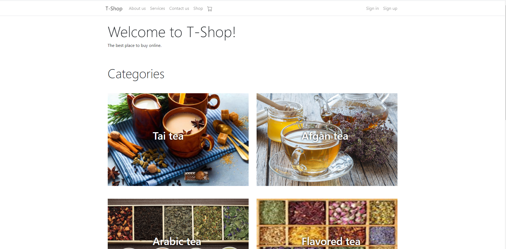

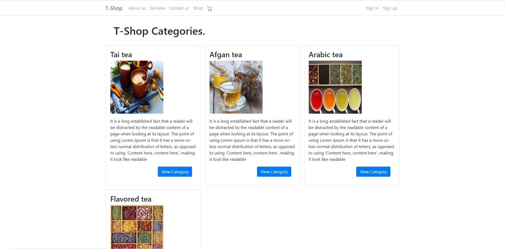

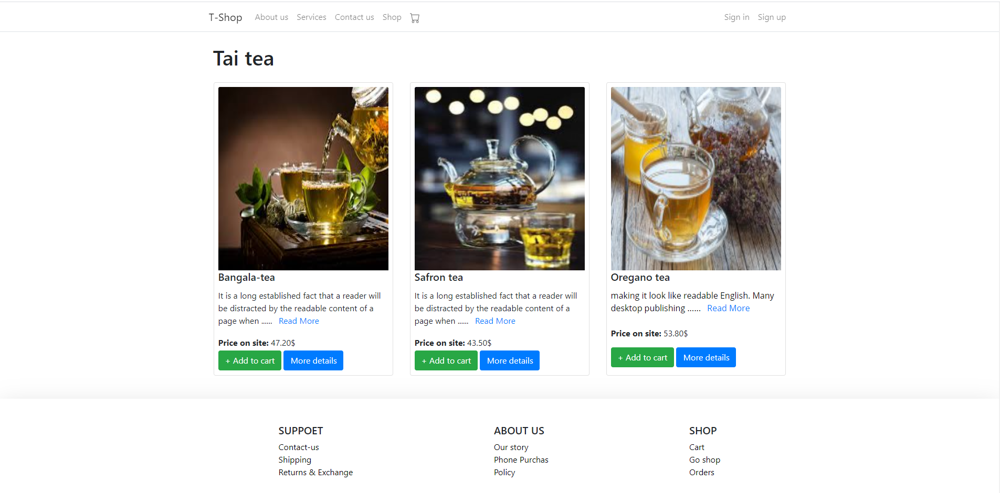


### Unregistered user can browse between products to 

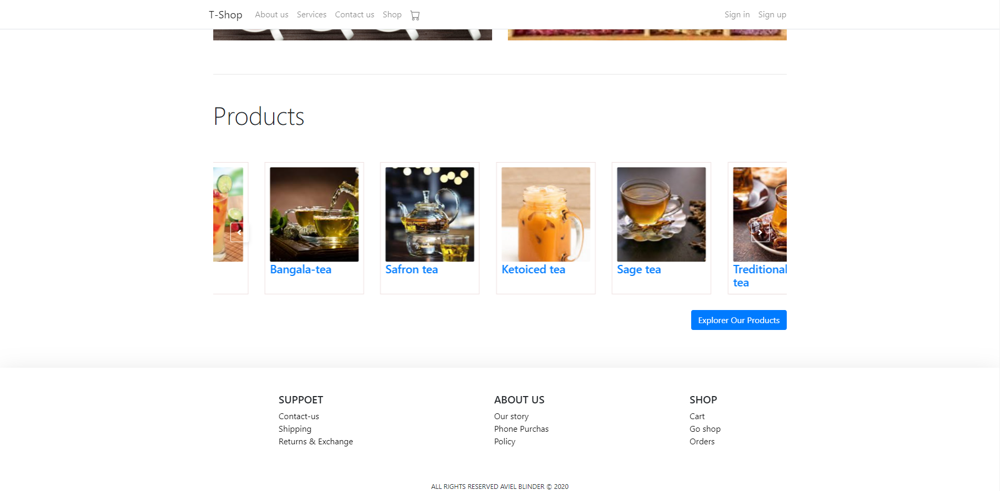

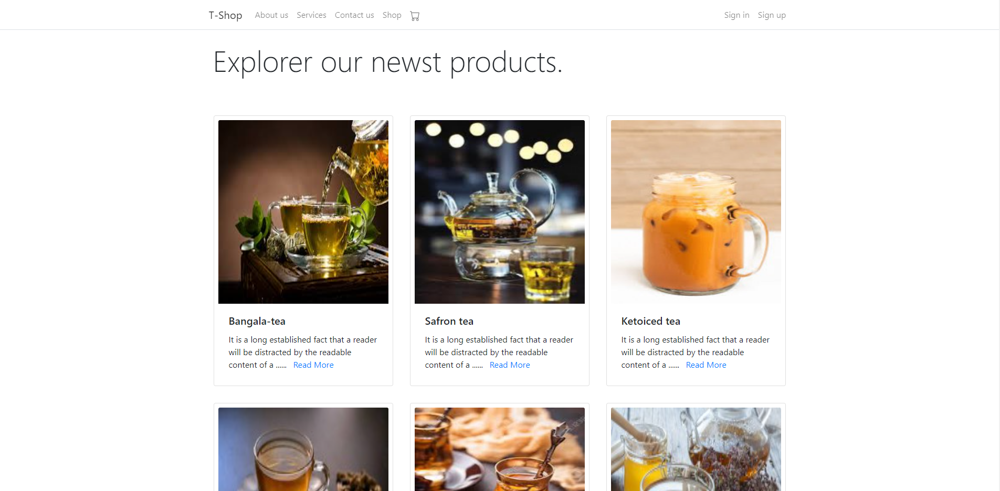

## After register

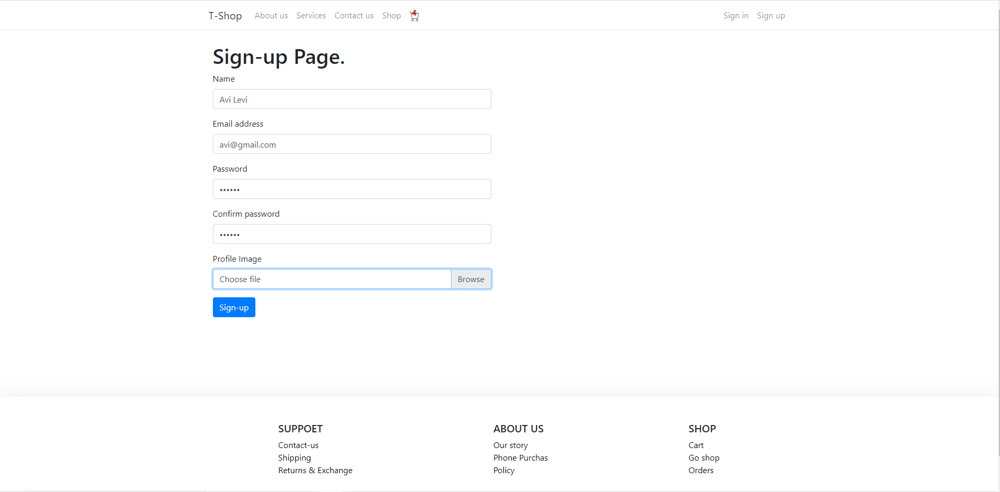

### User can add to cart 

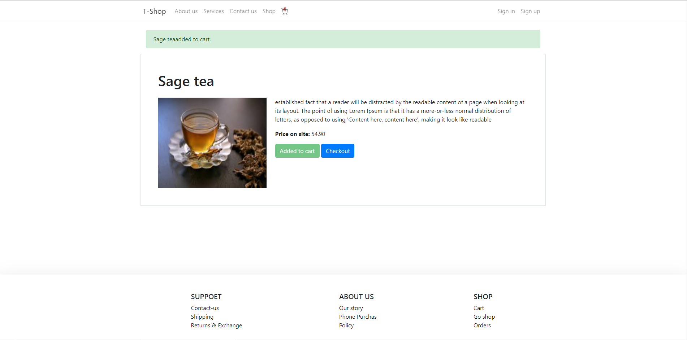

### Watch is cart and order

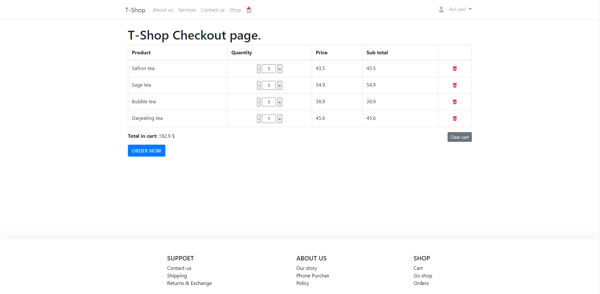

### User can also watch is profile and orders and edit is profile

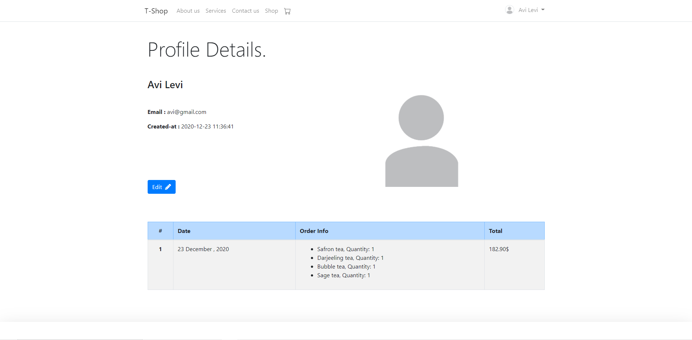

## Admin user can set / change / delete all the content and links in the website and manage orders 


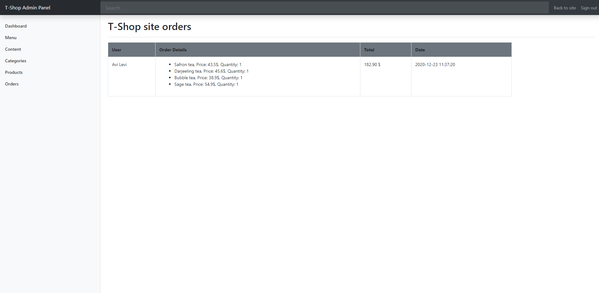

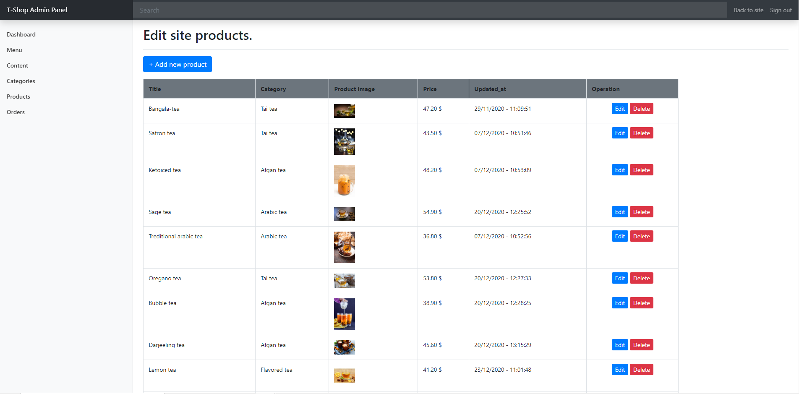

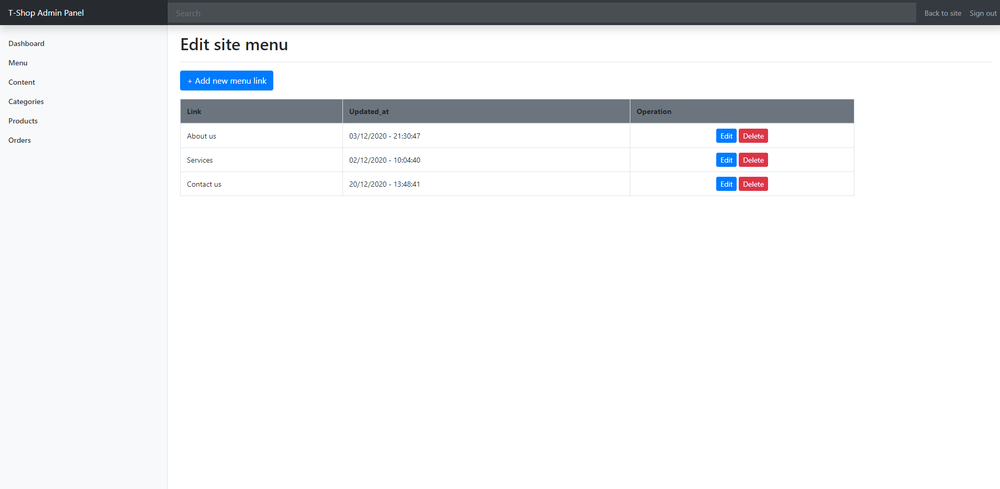

## Installation

1. Activate `XAMPP` if you dont have `XAMPP` download from [here](https://www.apachefriends.org/download.html).

3. Drag the downloaded file into `C:\xampp\htdocs`.

2. Open cmd in the spoken file and write 
    ```sh
    $ composer install
    ```
    if you don't have `composer` installed download from [here](https://getcomposer.org/).

4. Get into the browser to [http://localhost](http://localhost).

5. Press on t-shop/public file. 

## Free Experience 

> "You can enjoy free access to **T-Shop** 
> with no download in [Click To Open](https://t-shop-laravel.000webhostapp.com/public/) ."

